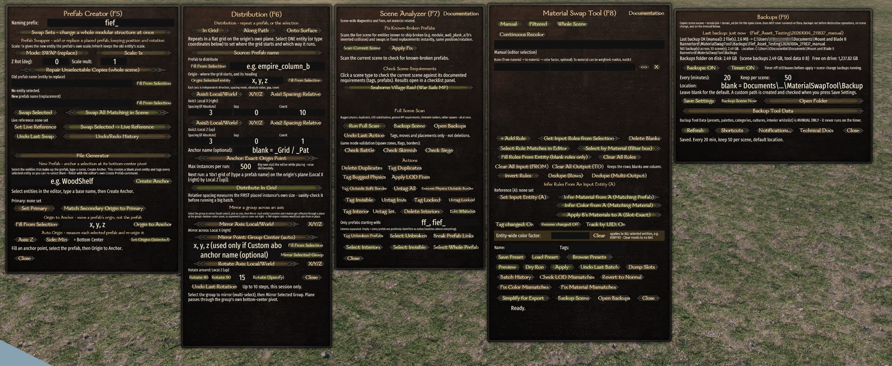
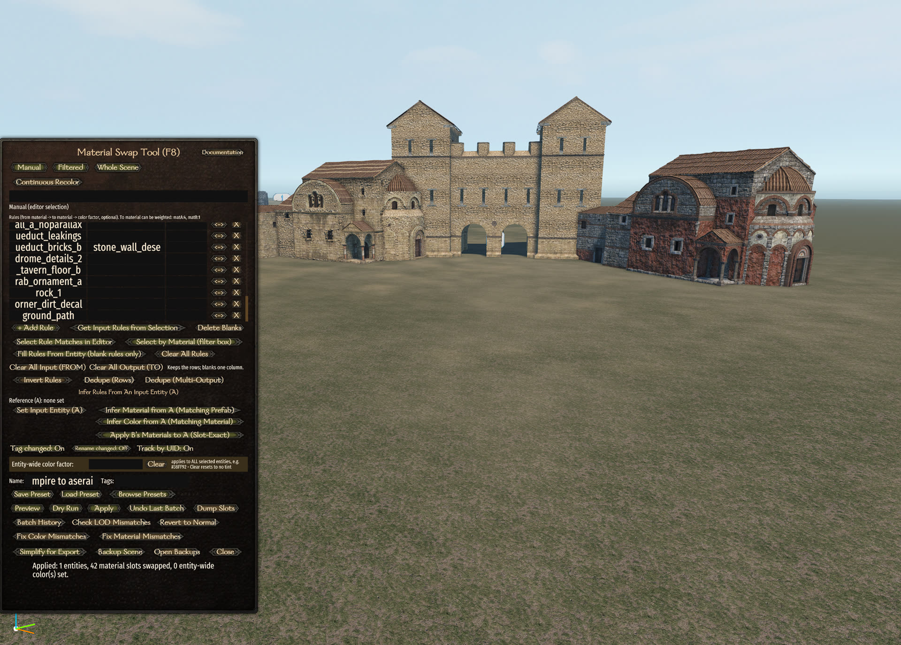

# Bannerlord Scene Toolkit

Editor tooling for **Mount & Blade II: Bannerlord** scene editing, running inside the game's
own scene editor (the Modding Kit / `Win64_Shipping_wEditor` build) as a single module.

Tools:
Material swapping and recoloring with presets (replace all materials correctly across multiple
entities with a single "Apply" click instead of manually overriding the materials on all individual
layers yourself), recoloring tool (apply color factors to all layers), and built-in rule presets 
which define how materials get changed. These rule sets can support weighted randomness, so if you
override an entire scene there can be different types of overrides at the end state for the same
input material (only one final rule set applies to a single target prefab, but it can vary across 
prefabs, if you use the right syntax on the rules for weighting). 

Prefab swapping and distribution tools (distribute entities into a grid, along a path, onto a surface), true 
mirroring and rotation about a chosen point (avoids scaling negatively along an axis to mirror). 
Prefab creation tools (manipulate origin positions) and a pile generator to scatter
entities randomly along a surface or surrounding a point. Also contains a scene analyzer with
battle, skirmish and siege requirement checks and one-click fixes. 

Automatic scene-file backups with retention. And a set of editor shortcuts the editor itself lacks:
isolate (hide everything else), repeat last transform (or repeat clone+translate with Shift+R similar to Blender), 
numeric transform, select whole prefab (my favorite one - Ctrl+Shift+P), grow selection sphere. 

Built for Calradic Campaign event maps but usable on any scene. The entirety of the Calradic Campaign #88 map
was made with heavy use of this tool, it has been used successfully on a real map. However, you use this tool
at your own risk; no warranty is expressly granted or implied.

New to multiplayer mapping? [docs/MAPPING-GUIDE.md](docs/MAPPING-GUIDE.md) has the MP scene
checklist (spawns, borders, flags, envmap, QA passes), Native scenes worth studying, and heightmap workflows.





## Tutorial video

A full walkthrough of every panel and button (2 h 31 m, chaptered):

[](https://www.youtube.com/watch?v=f1uzZ-qQm3c)

https://www.youtube.com/watch?v=f1uzZ-qQm3c

The video shows the v0.8.0 build (2026-08-23). Everything added since is in
[docs/CHANGELOG.md](docs/CHANGELOG.md); a transcript with chapter headings is in
[docs/TUTORIAL-TRANSCRIPT.md](docs/TUTORIAL-TRANSCRIPT.md).

## Hotkeys

| Key | Panel |
|-----|-------|
| F5 | Prefab Creator: new prefab, origin tools, pile generator, prefab swapper and swap sets |
| F6 | Distribution: in grid, along path, onto surface; mirror; rotate |
| F7 | Scene Analyzer: full scan, battle / skirmish / siege checks, fixes, tagging tools |
| F8 | Material Swap: rules, presets, infer from an entity, continuous recolor, culture generator |
| F9 | Backups, notifications, keyboard shortcut switches, documentation |

Optional shortcuts, all switchable from F9 > Shortcuts:

| Key | Action |
|-----|--------|
| Shift+O | Isolate the selection (hide everything else); press again to restore. Survives save, reload and test mode |
| Shift+R | Repeat the last recorded move, rotation or shift-drag copy on the current selection |
| Ctrl+Shift+T, or type a digit right after a gizmo drag | Numeric transform: exact move or rotate, world or local axis |
| Ctrl+Shift+P | Promote the selection to its top-level prefab roots |
| Ctrl+Numpad+/- | Grow/shrink the selection by proximity, live radius |
| Ctrl/Shift+Backspace | Clear the focused text field |
| Ctrl+Minus / Ctrl+Equals / Ctrl+0 | Panel size (number row, with a panel focused) |
| Ctrl+Alt+0 | Pop every open panel back to the centre of the screen |

Most panels have a **Documentation** button. That in-editor guide is the full feature
reference and is kept in sync with the code (source: `MaterialSwapTool/GUI/DocumentationVM.cs`).

## Installing

Requirements: Mount & Blade II: Bannerlord with the **Modding Kit** DLC installed (the
toolkit runs in the editor build, not the game client). Tested against game v1.4.8. Harmony
is bundled; nothing else to install.

1. Download the latest release zip and copy the `BannerlordSceneToolkit` folder into
   `...\Mount & Blade II Bannerlord\Modules\`.
2. Copy `tool_toggles.txt` into `Documents\Mount and Blade II Bannerlord\BannerlordSceneToolkit\`
   (create the folder). Optional: the module writes a default on first run.
3. Enable **Bannerlord Scene Toolkit** in the launcher's mod list, start the editor, and press
   F5 through F9.

`release/README.txt` is the same install guide as shipped in the zip, with the panel-size and
panel-position notes.

## Building from source

Requirements: the game installed with the editor binaries (`bin\Win64_Shipping_wEditor`),
.NET SDK (the project targets `net472`, x64, C# latest). The game path is the `BannerlordDir`
property in `src/BannerlordSceneToolkit/BannerlordSceneToolkit.csproj`; override it on the
command line if yours differs:

```
dotnet build src/BannerlordSceneToolkit/BannerlordSceneToolkit.csproj -c Release -p:SkipDeploy=true
dotnet build src/BannerlordSceneToolkit/BannerlordSceneToolkit.csproj -c Release "-p:BannerlordDir=D:\Steam\steamapps\common\Mount & Blade II Bannerlord"
```

A plain build deploys straight into the game's `Modules\BannerlordSceneToolkit` folder (DLL,
GUI prefabs, brushes, reference data, built-in presets). **Never run a deploying build while
the editor is open**: the deploy copies data files before the DLL, so a build that fails on
the locked DLL has already left an XML/DLL mismatch in the live module. Use `-p:SkipDeploy=true`
for compile checks.

`Tools/Package-SceneToolkit.ps1` assembles the release zip from the deployed module.

## Repository layout

```
src/BannerlordSceneToolkit/   The module: one csproj, Core/ plus three tool folders
  Core/                       Shared pieces (undo, backups glue, cursor, panel recentre, ...)
  MaterialSwapTool/           F7 + F8 + F9 and most shared infrastructure
  PrefabSwapperTool/          F6
  PrefabCreatorTool/          F5
  _Module/SubModule.xml       Module manifest
docs/                         CHANGELOG, KNOWN-ISSUES, ROADMAP, TROUBLESHOOTING, tutorial transcript
Tools/                        Packaging, standalone scene backup, export sync
release/                      The README and tool_toggles.txt shipped in the zip
```

## Runtime data

Each tool keeps its data under `Documents\Mount and Blade II Bannerlord\<ToolName>\`:
logs (`tool.log`, rolled at 10 MB), scene backups (`MaterialSwapTool\Backups`, one folder per
scene), presets, palettes, categories, cultures, swap sets, pile recipes. Scene backups copy
the **saved** `scene.xscene` / `terrain.bin` / `terrain_ed.bin` on a timer, on scene switch
and before destructive operations. They are a safety net, not a substitute for your own
backups.

## Known issues and roadmap

[docs/KNOWN-ISSUES.md](docs/KNOWN-ISSUES.md) lists engine limitations the toolkit works
around (scale never carries over an instantiate-based swap; copies of unsaved prefabs are not
click-selectable until the scene is saved; runtime physics changes need a reload) and the
items awaiting live verification. [docs/ROADMAP.md](docs/ROADMAP.md) is the canonical list
of planned, deferred and retired features.

## Credits

Scene Analyzer checks were ported from the community **BannerlordSceneAnalyzer** PowerShell
project; the Skirmish and editor-spawn checks come from **Gotha's BL_AddTestScene** mod.
Harmony by Andreas Pardeike. Everything else by Fief Eviction Notice (thanks to Claude).

## License

**CC BY-NC 4.0** with one additional permission. You may use, share and modify the toolkit
for non-commercial purposes with credit to Fief Eviction Notice. Additionally, a private
individual may use it for a submission to a **publicly announced TaleWorlds competition
that is open to public submissions**, prizes included; private or unannounced events and
organizational use do not qualify. Full text, including the exact wording of that
permission, in [LICENSE.md](LICENSE.md). TaleWorlds' Mod Tools EULA applies in addition.
